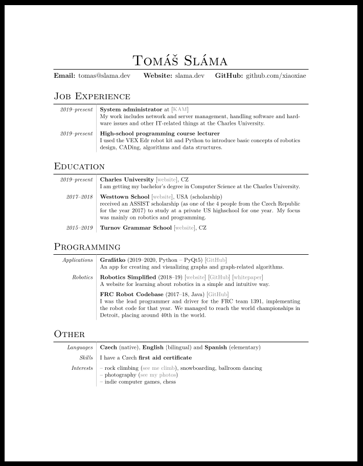

# CV
The repository for my (or yours, if you fork this 😉) CV. Supported export formats are:
- **LaTeX** (requires `pandoc` + `markdown` Python package)
- **PDF** (requires `pandoc` + `markdown` Python package + `lualatex`)
- **HTML** (requires `pandoc` + `markdown` Python package)

Input is the `cv.yaml` file, the format is pretty self-explanatory. The strings themselves are in Markdown (with some HTML tags here and there), since it's quite a nice format to write reasonably in.

## Preview

